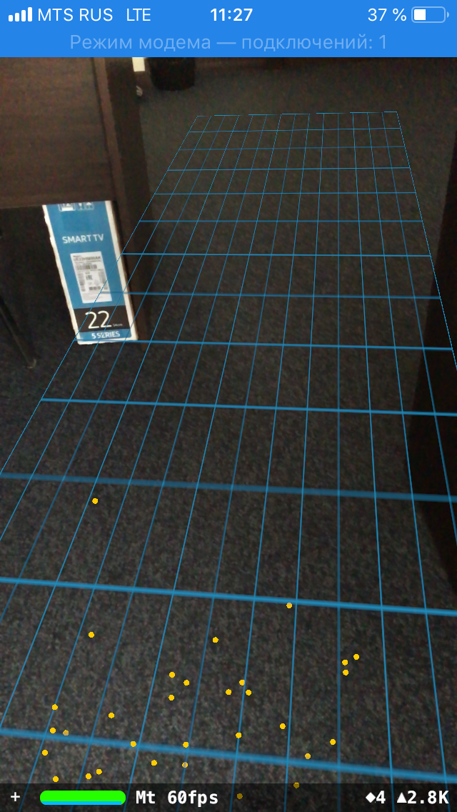

# Detection plane and add a mesh



## Plane Class

```
class Plane: SCNNode {
    
    var anchor: ARPlaneAnchor!
    var planeGeometry: SCNPlane!
    
    init(anchor: ARPlaneAnchor) {
        self.anchor = anchor
        super.init()
        configure()
    }
    private func configure() {
        

        self.planeGeometry = SCNPlane(width: CGFloat(anchor.extent.x), height: CGFloat(anchor.extent.z))
        
        let material = SCNMaterial()
        
        material.diffuse.contents = UIImage(named: "grid.png")
        
        
        self.planeGeometry.materials = [material]
        
        self.geometry = planeGeometry
        
        self.position = SCNVector3(anchor.center.x, 0, anchor.center.z)
        
        self.transform = SCNMatrix4MakeRotation(Float(-Double.pi/2), 1.0, 0.0, 0.0)
        
    }
    
    func update(anchor: ARPlaneAnchor) {
        self.planeGeometry.width = CGFloat(anchor.extent.x)
        self.planeGeometry.height = CGFloat(anchor.extent.z)
        self.position = SCNVector3(anchor.center.x, 0, anchor.center.z)
    }
    required init?(coder aDecoder: NSCoder) {
        fatalError("init(coder:) has not been implemented")
    }
}

```

## extension ARSCNViewDelegate

```
extension ViewController: ARSCNViewDelegate {
    
    func renderer(_ renderer: SCNSceneRenderer, didAdd node: SCNNode, for anchor: ARAnchor) {
        guard anchor is ARPlaneAnchor else { return }
        let plane = Plane(anchor: anchor as! ARPlaneAnchor)
        
        self.planes.append(plane)
        node.addChildNode(plane)
    
    }
    
    func renderer(_ renderer: SCNSceneRenderer, didUpdate node: SCNNode, for anchor: ARAnchor) {
        let plane = self.planes.filter { plane in
            return plane.anchor.identifier == anchor.identifier
        }.first
        
        guard plane != nil else { return }
        
        plane?.update(anchor: anchor as! ARPlaneAnchor)
    }
}

```


